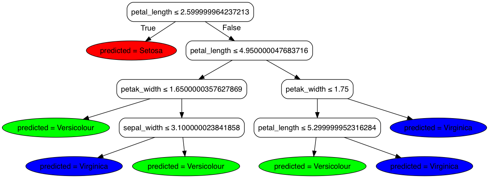

<!--
  Licensed to the Apache Software Foundation (ASF) under one
  or more contributor license agreements.  See the NOTICE file
  distributed with this work for additional information
  regarding copyright ownership.  The ASF licenses this file
  to you under the Apache License, Version 2.0 (the
  "License"); you may not use this file except in compliance
  with the License.  You may obtain a copy of the License at

    http://www.apache.org/licenses/LICENSE-2.0

  Unless required by applicable law or agreed to in writing,
  software distributed under the License is distributed on an
  "AS IS" BASIS, WITHOUT WARRANTIES OR CONDITIONS OF ANY
  KIND, either express or implied.  See the License for the
  specific language governing permissions and limitations
  under the License.
-->

# Dataset

* https://archive.ics.uci.edu/ml/datasets/Iris

```
Attribute Information:
   1. sepal length in cm
   2. sepal width in cm
   3. petal length in cm
   4. petal width in cm
   5. class: 
      -- Iris Setosa
      -- Iris Versicolour
      -- Iris Virginica
```

# Table preparation

```sql
create database iris;
use iris;

create external table raw (
  sepal_length int,
  sepal_width int,
  petal_length int,
  petak_width int,
  class string
)
ROW FORMAT DELIMITED
  FIELDS TERMINATED BY ','
  LINES TERMINATED BY '\n'
STORED AS TEXTFILE LOCATION '/dataset/iris/raw';

$ sed '/^$/d' iris.data | hadoop fs -put - /dataset/iris/raw/iris.data
```

```sql
create table label_mapping 
as
select
  class,
  rank - 1 as label
from (
select
  distinct class,
  dense_rank() over (order by class) as rank
from 
  raw
) t
;
```

```sql
create table training
as
select
  rowid() as rowid,
  array(t1.sepal_length, t1.sepal_width, t1.petal_length, t1.petak_width) as features,
  t2.label
from
  raw t1
  JOIN label_mapping t2 ON (t1.class = t2.class)
;
```

# Training

`train_randomforest_classifier` takes a dense `features` in double[] and a `label` starting from 0.

```sql
CREATE TABLE model 
  STORED AS SEQUENCEFILE 
AS
select 
  train_randomforest_classifier(features, label) 
  -- hivemall v0.4.1-alpha.2 and before
  -- train_randomforest_classifier(features, label) as (pred_model, var_importance, oob_errors, oob_tests)
  -- hivemall v0.4.1 and later
  -- train_randomforest_classifier(features, label) as (model_id, model_type, pred_model, var_importance, oob_errors, oob_tests)
from
  training;
```

> #### Caution
> The default `TEXTFILE` should not be used for model table when using Javascript output through `-output javascript` option.

```sql
hive> desc extended model;
```

| col_name | data_type 
|:-:|:-:|
| model_id               | string | 
| model_weight           | double |
| model                  | string |
| var_importance         | array<double> |                               
| oob_errors             | int    |    
| oob_tests              | int    |


## Training options

`-help` option shows usage of the function.

```sql
select train_randomforest_classifier(features, label, "-help") from training;

> FAILED: UDFArgumentException 
usage: train_randomforest_classifier(array<double|string> features, int
       label [, const array<double> classWeights, const string options]) -
       Returns a relation consists of <int model_id, int model_type,
       string pred_model, array<double> var_importance, int oob_errors,
       int oob_tests, double weight> [-attrs <arg>] [-depth <arg>] [-help]
       [-leafs <arg>] [-min_samples_leaf <arg>] [-rule <arg>] [-seed
       <arg>] [-splits <arg>] [-stratified] [-subsample <arg>] [-trees
       <arg>] [-vars <arg>]
 -attrs,--attribute_types <arg>      Comma separated attribute types (Q
                                     for quantitative variable and C for
                                     categorical variable. e.g.,
                                     [Q,C,Q,C])
 -depth,--max_depth <arg>            The maximum number of the tree depth
                                     [default: Integer.MAX_VALUE]
 -help                               Show function help
 -leafs,--max_leaf_nodes <arg>       The maximum number of leaf nodes
                                     [default: Integer.MAX_VALUE]
 -min_samples_leaf <arg>             The minimum number of samples in a
                                     leaf node [default: 1]
 -rule,--split_rule <arg>            Split algorithm [default: GINI,
                                     ENTROPY]
 -seed <arg>                         seed value in long [default: -1
                                     (random)]
 -splits,--min_split <arg>           A node that has greater than or
                                     equals to `min_split` examples will
                                     split [default: 2]
 -stratified,--stratified_sampling   Enable Stratified sampling for
                                     unbalanced data
 -subsample <arg>                    Sampling rate in range (0.0,1.0]
 -trees,--num_trees <arg>            The number of trees for each task
                                     [default: 50]
 -vars,--num_variables <arg>         The number of random selected
                                     features [default:
                                     ceil(sqrt(x[0].length))].
                                     int(num_variables * x[0].length) is
                                     considered if num_variable is (0,1
```

> #### Caution
> `-num_trees` controls the number of trees for each task, not the total number of trees.

### Parallelize Training

To parallelize RandomForest training, you can use UNION ALL as follows:

```sql
CREATE TABLE model 
  STORED AS ORC tblproperties("orc.compress"="SNAPPY")
  -- STORED AS SEQUENCEFILE 
AS
select 
  train_randomforest_classifier(features, label, '-trees 25') 
from
  training
UNION ALL
select 
  train_randomforest_classifier(features, label, '-trees 25')
from
  training
;
```

### Learning stats

[`Variable importance`](https://www.stat.berkeley.edu/~breiman/RandomForests/cc_home.htm#varimp) and [`Out Of Bag (OOB) error rate`](https://www.stat.berkeley.edu/~breiman/RandomForests/cc_home.htm#ooberr) of RandomForest can be shown as follows:

```sql
select
  array_sum(var_importance) as var_importance,
  sum(oob_errors) / sum(oob_tests) as oob_err_rate
from
  model;
```
> [6.837674865013268,4.1317115752776665,24.331571871930226,25.677497925673062]    0.056666666666666664

# Prediction

```sql
set hivevar:classification=true;
set hive.auto.convert.join=true;
set hive.mapjoin.optimized.hashtable=false;

create table predicted
as
SELECT
  rowid,
  -- rf_ensemble(predicted) as predicted
  -- hivemall v0.5-rc.1 or later
  rf_ensemble(predicted.value, predicted.posteriori, model_weight) as predicted
  -- rf_ensemble(predicted.value, predicted.posteriori) as predicted -- avoid OOB accuracy (i.e., model_weight)
FROM (
  SELECT
    rowid, 
    -- hivemall v0.4.1-alpha.2 and before
    -- tree_predict(p.model, t.features, ${classification}) as predicted
    -- hivemall v0.4.1 and later
    -- tree_predict(p.model_id, p.model_type, p.pred_model, t.features, ${classification}) as predicted
    -- hivemall v0.5-rc.1 or later
    p.model_weight,
    tree_predict(p.model_id, p.model, t.features, ${classification}) as predicted
  FROM
    model p
    LEFT OUTER JOIN -- CROSS JOIN
    training t
) t1
group by
  rowid
;
```

### Parallelize Prediction

The following query runs predictions in N-parallel. It would reduce elapsed time for prediction almost by N.

```sql
SET hivevar:classification=true;
set hive.auto.convert.join=true;
SET hive.mapjoin.optimized.hashtable=false;
SET mapred.reduce.tasks=8;

create table predicted
as
SELECT
  rowid,
  -- rf_ensemble(predicted) as predicted
  -- hivemall v0.5-rc.1 or later
  rf_ensemble(predicted.value, predicted.posteriori, model_weight) as predicted
  -- rf_ensemble(predicted.value, predicted.posteriori) as predicted -- avoid OOB accuracy (i.e., model_weight)
FROM (
  SELECT
    t.rowid, 
    -- hivemall v0.4.1-alpha.2 and before
    -- tree_predict(p.pred_model, t.features, ${classification}) as predicted
    -- hivemall v0.4.1 and later
    -- tree_predict(p.model_id, p.model_type, p.pred_model, t.features, ${classification}) as predicted
    -- hivemall v0.5-rc.1 or later
    p.model_weight,
    tree_predict(p.model_id, p.model, t.features, ${classification}) as predicted
  FROM (
    SELECT 
      -- model_id, model_type, pred_model
      -- hivemall v0.5-rc.1 or later
      model_id, model_weight, model
    FROM model
    DISTRIBUTE BY rand(1)
  ) p 
  LEFT OUTER JOIN training t
) t1
group by
  rowid
;
```

# Evaluation

```sql
select count(1) from training;
```
> 150

```sql
set hivevar:total_cnt=150;

WITH t1 as (
SELECT
  t.rowid,
  t.label as actual,
  p.predicted.label as predicted
FROM
  predicted p
  LEFT OUTER JOIN training t ON (t.rowid = p.rowid)
)
SELECT
  count(1) / ${total_cnt}
FROM
  t1
WHERE
  actual = predicted
;
```
> 0.98

# Graphvis export

> #### Note
> `tree_export` feature is supported from Hivemall v0.5-rc.1 or later.
> Better to limit tree depth on training by `-depth` option to plot a Decision Tree.

Hivemall provide `tree_export` to export a decision tree into [Graphviz](http://www.graphviz.org/) or human-readable Javascript format. You can find the usage by issuing the following query:

```
> select tree_export("","-help");

usage: tree_export(string model, const string options, optional
       array<string> featureNames=null, optional array<string>
       classNames=null) - exports a Decision Tree model as javascript/dot]
       [-help] [-output_name <arg>] [-r] [-t <arg>]
 -help                             Show function help
 -output_name,--outputName <arg>   output name [default: predicted]
 -r,--regression                   Is regression tree or not
 -t,--type <arg>                   Type of output [default: js,
                                   javascript/js, graphvis/dot
```

```sql
CREATE TABLE model_exported 
  STORED AS ORC tblproperties("orc.compress"="SNAPPY")
AS
select
  model_id,
  tree_export(model, "-type javascript", array('sepal_length','sepal_width','petal_length','petak_width'), array('Setosa','Versicolour','Virginica')) as js,
  tree_export(model, "-type graphvis", array('sepal_length','sepal_width','petal_length','petak_width'), array('Setosa','Versicolour','Virginica')) as dot
from
  model
-- limit 1
;
```

```
digraph Tree {
 node [shape=box, style="filled, rounded", color="black", fontname=helvetica];
 edge [fontname=helvetica];
 0 [label=<petal_length &le; 2.599999964237213>, fillcolor="#00000000"];
 1 [label=<predicted = Setosa>, fillcolor="0.0000,1.000,1.000", shape=ellipse];
 0 -> 1 [labeldistance=2.5, labelangle=45, headlabel="True"];
 2 [label=<petal_length &le; 4.950000047683716>, fillcolor="#00000000"];
 0 -> 2 [labeldistance=2.5, labelangle=-45, headlabel="False"];
 3 [label=<petak_width &le; 1.6500000357627869>, fillcolor="#00000000"];
 2 -> 3;
 4 [label=<predicted = Versicolour>, fillcolor="0.3333,1.000,1.000", shape=ellipse];
 3 -> 4;
 5 [label=<sepal_width &le; 3.100000023841858>, fillcolor="#00000000"];
 3 -> 5;
 6 [label=<predicted = Virginica>, fillcolor="0.6667,1.000,1.000", shape=ellipse];
 5 -> 6;
 7 [label=<predicted = Versicolour>, fillcolor="0.3333,1.000,1.000", shape=ellipse];
 5 -> 7;
 8 [label=<petak_width &le; 1.75>, fillcolor="#00000000"];
 2 -> 8;
 9 [label=<petal_length &le; 5.299999952316284>, fillcolor="#00000000"];
 8 -> 9;
 10 [label=<predicted = Versicolour>, fillcolor="0.3333,1.000,1.000", shape=ellipse];
 9 -> 10;
 11 [label=<predicted = Virginica>, fillcolor="0.6667,1.000,1.000", shape=ellipse];
 9 -> 11;
 12 [label=<predicted = Virginica>, fillcolor="0.6667,1.000,1.000", shape=ellipse];
 8 -> 12;
}
```



You can draw a graph by `dot -Tpng iris.dot -o iris.png` or using [Viz.js](http://viz-js.com/).